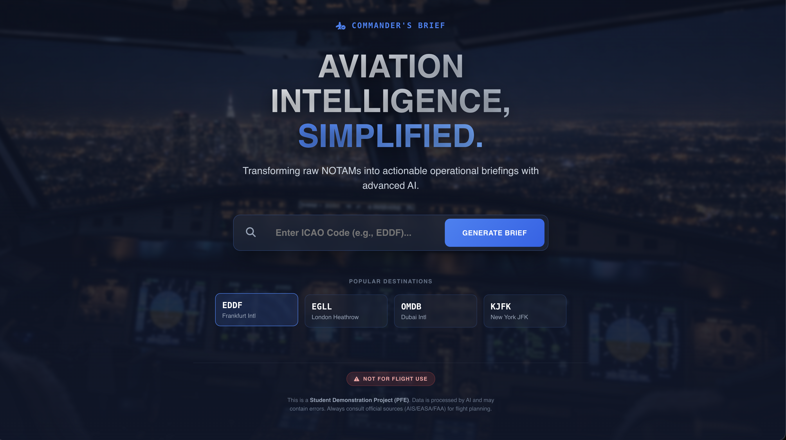
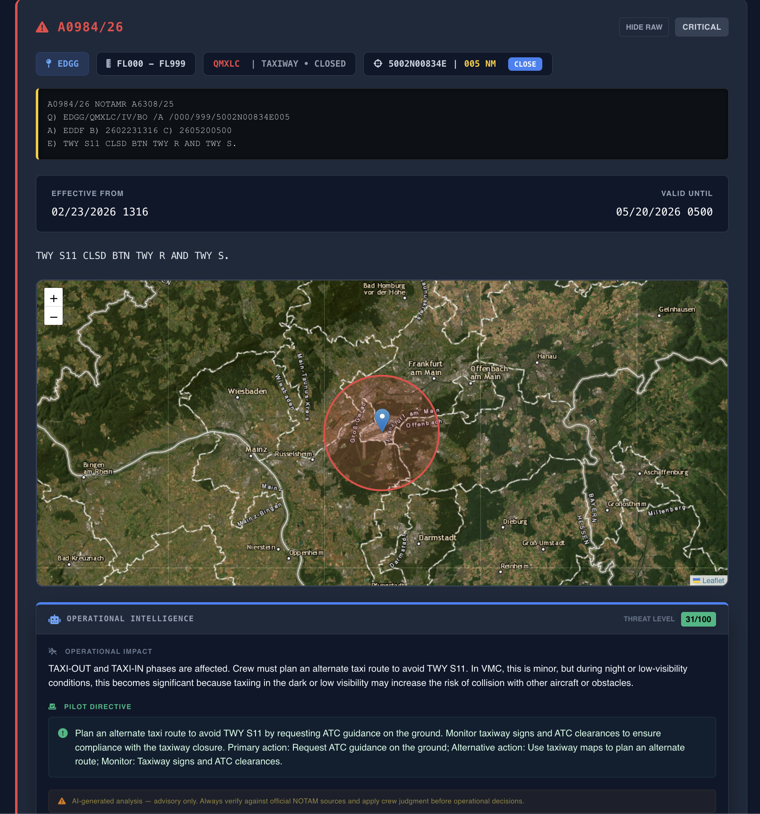
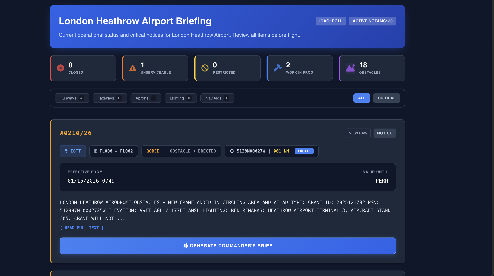

# NotamLens

AI-powered aviation platform that fetches, analyzes, and visualizes NOTAMs using LLMs and interactive maps.

## 1. 🚀 Overview

Aviation safety depends on reviewing Notices to Air Missions (NOTAMs), but these warnings are traditionally published in a cryptic, abbreviated format. **NotamLens** bridges this gap by automatically translating dense, coded warnings into clear, human-readable intelligence. By extracting coordinate data and risk classifications, it fundamentally accelerates pre-flight briefings and enhances situational awareness for modern flight crews.

## 2. ✈️ Key Features

- **NOTAM fetching (FAA sources)**: Actively fetches and parses real-time NOTAM HTML data directly from official sources.
- **AI/LLM-based parsing and simplification**: Leverages modern LLMs (like Groq/LLaMA and Mixtral fallbacks) to process raw text into clean, structured "Commander's Briefs".
- **Interactive map visualization**: Plots precise NOTAM coordinates and affected radii on an interactive Leaflet map.
- **Fast caching system**: Employs an aggressive in-memory TTLCache with MD5-deduplication to minimize LLM latency.
- **Clean API backend (FastAPI)**: A robust, high-performance REST API handling the scraping, validation, and delivery.

## 3. 🧠 How It Works

The platform operates via a streamlined pipeline:
- **Data ingestion**: A backend scraper fetches live HTML data and extracts Q-lines using regex and BS4.
- **AI processing**: When triggered, raw NOTAM text is sent to the LLM engine for detailed simplification and risk assessment.
- **API**: The Python backend serves this structured data to the frontend.
- **Frontend map**: The React client consumes the data to populate a dynamic UI dashboard and an overlaid interactive map.

## 4. 🛠 Tech Stack

- **Python / FastAPI**: High-concurrency backend services and REST API endpoints.
- **LLM (Groq / Gemini)**: Artificial intelligence engine for parsing complex legacy text.
- **Frontend**: React 18, Vite, Tailwind CSS for a modern, responsive user interface.
- **Map libraries**: React-Leaflet for geospatial data plotting.

## 5. 📦 Installation

**Prerequisites:** Python 3.13+ and Node.js 18+

### Backend Setup
```bash
git clone https://github.com/ayoubgeek/NotamLens.git
cd NotamLens/src/backend
python -m venv venv
source venv/bin/activate  # On Windows: venv\Scripts\activate
pip install -r requirements.txt
python -m app.main
```

### Frontend Setup
```bash
cd ../frontend
npm install
npm run dev
```

### Environment Variables
Configure `.env` in `src/backend/`:
```env
GROQ_API_KEY=your_api_key
REDIS_URL=redis://localhost:6379 
```

## 6. 📸 Screenshots


*Dashboard showing incoming NOTAMs and risk assessments.*


*Geospatial representation of NOTAM boundaries.*


*AI-simplified analysis view.*

## 7. 📌 Future Improvements

- **Real-time NOTAM updates**: Implementing WebSockets for persistent upstream connections.
- **Flight route analysis**: Enabling comparative multi-ICAO querying and route-intersection detection.
- **Alert system**: Setting up configurable threshold-based mobile or email push notifications.
