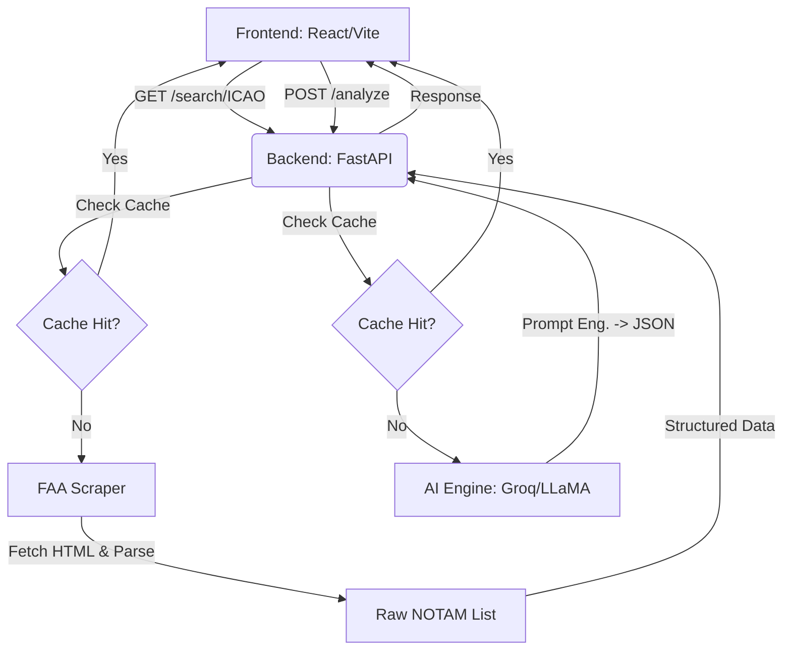

# NotamLens ✈️

**Live Demo:** [notamlens.com](https://www.notamlens.com/)

> **NotamLens** is an AI-powered tactical aviation intelligence platform. It ingests legacy, cryptic Notice to Air Missions (NOTAMs) from official FAA endpoints and uses Large Language Models (LLMs) to automatically translate them into structured, human-readable Commander's Briefings with actionable risk assessments.
---

## 📖 The Problem: Cryptic Aviation Data
Aviation safety depends heavily on NOTAMs. However, these critical warnings are traditionally published in a dense, heavily abbreviated legacy format (e.g., `Q) EDGG/QMXLC/IV/M/A/000/999/5002N00834E005`). This forces pilots to spend significant time decoding text rather than analyzing operational risk, leading to fatigue and potential human error during pre-flight preparation.

## 💡 The Solution: NotamLens
By injecting Modern AI into the pre-flight routine, NotamLens bridges this gap.
- **Automated Translation:** Translates dense ICAO abbreviations into clear English.
- **Risk Assessment:** Assigns a 0-100 Threat Score and color-coded risk levels based on severity.
- **Geospatial Context:** Plots precise NOTAM coordinates and affected radii on an interactive map.
- **Operational Directives:** Extracts the "So What?" (Impact) and "Now What?" (Crew Action) for every alert.

## ✨ Key Features
- **Real-Time Data Acquisition:** Scrapes and normalizes live NOTAM HTML data directly from official FAA sources.
- **Dual-Model LLM Engine:** Utilizes advanced prompt engineering with Groq (Llama-3.1 primary, Mixtral fallback) to parse complex text into strict JSON schemas with near-zero latency.
- **Semantic UI & Filtering:** A mobile-first, responsive React dashboard with dynamic categorical filters (Runways, NavAids, Closed, WIP).
- **High-Performance Infrastructure:** Implements an aggressive in-memory caching system with MD5-deduplication to minimize LLM inference costs and reduce FAA API roundtrips.
- **Interactive Map Visualization:** Built natively with React-Leaflet to project standard aviation Q-Code coordinates globally.

## 🏗️ Architecture & Workflow



## 🛠️ Tech Stack
- **Backend:** Python 3.13, FastAPI, Pydantic, Regular Expressions (Regex), OpenAI SDK (for Groq)
- **Frontend:** React 18, Vite, Tailwind CSS, React-Router, React-Leaflet
- **AI Infrastructure:** Groq API (Llama-3.1-8b-instant, Mixtral-8x7b-32768)
- **Deployment:** Vercel (Frontend), GitHub Actions (CI/CD)

## 📁 Project Structure
```text
NotamLens/
├── backend/                  # Python FastAPI Server
│   ├── app/
│   │   ├── api/v1/           # REST Endpoints (search, analyze)
│   │   ├── core/             # Configuration & Exceptions
│   │   ├── schemas/          # Pydantic Data Models
│   │   └── services/         # FAA Scraper, AI Engine, Cache
│   └── requirements.txt
├── frontend/                 # React UI
│   ├── src/
│   │   ├── api/              # Axios Client
│   │   ├── components/       # Responsive Components (NotamCard, Map, etc.)
│   │   └── utils/            # Decoders & Geospatial Formatters
│   ├── index.html
│   └── tailwind.config.js
└── README.md
```

## 🚀 Installation & Local Setup
**Prerequisites:** Python 3.13+ and Node.js 18+

### 1. Backend Setup
```bash
git clone https://github.com/ayoubgeek/NotamLens.git
cd NotamLens/backend

# Create and activate virtual environment
python -m venv venv
source venv/bin/activate  # On Windows: venv\Scripts\activate

# Install dependencies
pip install -r requirements.txt

# Create .env file
echo "GROQ_API_KEY=your_groq_api_key_here" > .env

# Run the backend (Development mode)
python -m app.main
```
*The API will be available at `http://localhost:8000`*

### 2. Frontend Setup
```bash
# Open a new terminal window
cd NotamLens/frontend

# Install dependencies
npm install

# Run the development server
npm run dev
```
*The UI will be available at `http://localhost:5173`*

## 📸 Interface Previews
| Main Dashboard | Interactive Map | Commander's Brief |
|:---:|:---:|:---:|
|  |  |  |

## 🎓 Academic / PFE Context
This project was developed as a **Projet de Fin d'Études (PFE)**. It demonstrates end-to-end full-stack engineering proficiency, integrating:
- **System Design:** Handling 3rd-party unreliability (FAA legacy endpoints) via abstraction and caching.
- **Applied AI:** Moving beyond simple conversational chatbots to strict JSON-enforced, rule-based inference.
- **Modern UI/UX:** Translating dense data blocks into an elegant, highly-scannable interface designed for mission-critical environments.

## 🔜 Future Improvements
- **Real-Time Data Pipelines:** Migrating from pull-based scraping to persistent upstream WebSockets.
- **Spatial Intersections:** Implementing multi-ICAO querying and route-intersection detection for en-route flight planning.
- **User Authentication:** Enabling pilot profiles to save custom fleet layouts (e.g., filtering out A320 limitations when flying a B737).

---
*Built with passion for Aviation & AI.*
